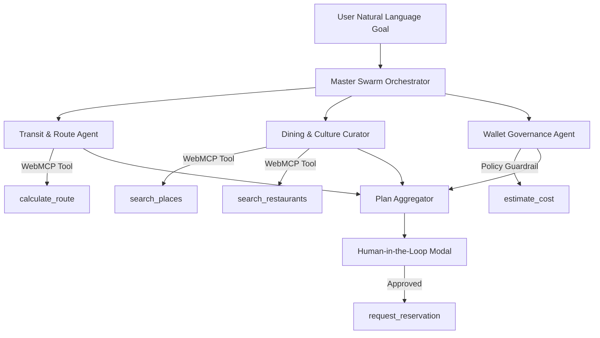

# 🚀 HelloBusan WebMCP - Future Enhancements & Technical Roadmap

This document outlines the strategic technical enhancements and architectural roadmap for scaling **HelloBusan WebMCP** from an interactive hackathon demonstration to a production-grade **Agentic City Platform**.

---

## 1. Multi-Agent Swarm Orchestration (Deductive Multi-Agent System)

### Overview
Currently, HelloBusan uses a sequential single-agent planner loop. To improve throughput and scalability, the architecture can be evolved into a **Specialized Multi-Agent Swarm**.

### Sub-Agent Roles
1. **Transit & Spatial Agent (`calculate_route`)**:
   - Specialized in real-time subway/bus GIS topology, indoor walking paths, and rain safety corridors.
2. **Gourmet & Cultural Curator Agent (`search_restaurants`, `search_places`)**:
   - Evaluates dietary constraints, kid-friendly amenities, real-time wait times, and dietary preferences.
3. **Financial & Governance Guardrail Agent (`Agent Wallet`)**:
   - Enforces zero-trust spending caps, validates `READ`/`WRITE`/`SENSITIVE` policy scopes, and intercepts unauthorized API mutations.
4. **Booking & Reservation Agent (`request_reservation`)**:
   - Manages asynchronous API webhooks, human approval prompts, and seat confirmation receipts.

---

## 2. Browser Extension & Native Cross-Domain Injection

### Overview
Enable any external website (e.g., `visitbusan.net`, `busanfood.go.kr`, `booking.busan.go.kr`) to become instantly WebMCP-compatible without site owners modifying their codebase.

### Key Capabilities
- **Chrome Extension / Tampermonkey Polyfill**:
  - Automatically injects `navigator.modelContext` runtime into third-party web pages.
- **Auto-Schema Inference**:
  - Automatically extracts HTML form inputs, buttons, and API fetch endpoints, generating standardized WebMCP `inputSchema` objects dynamically.
- **Cross-Domain WebMCP Bridge**:
  - Facilitates secure cross-origin message passing (`postMessage`) between municipal micro-frontends and the Agent Governance Wallet.

---

## 3. WebAuthn Biometric & Escrow Financial Guardrails

### Overview
Elevate financial security for `SENSITIVE` tools (`request_reservation`, `execute_payment`) using hardware-level biometrics.

### Features
- **Passkey / WebAuthn Integration**:
  - When the agent attempts a financial transaction or booking, prompt the user for Apple FaceID / TouchID or Windows Hello biometric confirmation.
- **Micropayment Escrow Wallet**:
  - Pre-fund a micro-budget (e.g., ₩50,000) into a smart escrow contract. The agent can only execute zero-gas micro-transactions within the locked scope.
- **Audit Cryptographic Proof**:
  - Sign every Black Box Audit Log entry with asymmetric keypairs, proving human authorization for every agent action.

---

## 4. Real-time IoT & Edge Weather/Crowd Signal Integration

### Overview
Transition from static weather datasets to real-time city sensor streaming.

### Data Sources
- **Live IoT CCTV & Foot-Traffic Sensors**:
  - Real-time crowd density index at Haeundae Beach, Gwangalli, and Jagalchi Market.
- **Busan Open API Weather & Marine Signals**:
  - Live precipitation updates, wave height indicators, and subway station flooding advisories.
- **Proactive Dynamic Rerouting**:
  - If heavy rain begins, the agent autonomously calls `update_itinerary` to replace outdoor walking segments with indoor subway connected passages within 3 seconds.

---

## 5. Serverless D1 Edge Caching & Offline PWA Protocol

### Overview
Ensure 100% availability even when travelers are in subway tunnels, elevators, or areas with weak cellular reception.

### Architecture
- **Service Worker WebMCP Schema Cache**:
  - Cache tool schemas and execution fallbacks locally in IndexedDB / Service Worker Cache.
- **Cloudflare D1 Federated Sync**:
  - Read queries hit local cache or Cloudflare D1 Edge databases in < 15ms.
- **Progressive Web App (PWA)**:
  - Installable on iOS and Android homescreens with full offline map vector rendering.

---

## Summary Roadmap Timeline

| Phase | Milestone | Focus Areas | Est. Delivery |
| :--- | :--- | :--- | :--- |
| **Phase 1** | MVP Hackathon Release | 10 WebMCP Schema Tools, Wallet Governance, Dark Map, i18n | **Completed (Current)** |
| **Phase 2** | Multi-Agent Swarm | Parallel sub-agent planner, sub-second execution (< 1.2s) | Q4 2026 |
| **Phase 3** | Chrome Extension | Native cross-domain tool injection on any website | Q1 2027 |
| **Phase 4** | WebAuthn & Escrow | Passkey biometric signatures & real-time spending caps | Q2 2027 |
| **Phase 5** | IoT City Integration | Dynamic CCTV crowd routing & Busan Municipal API Sync | Q3 2027 |
